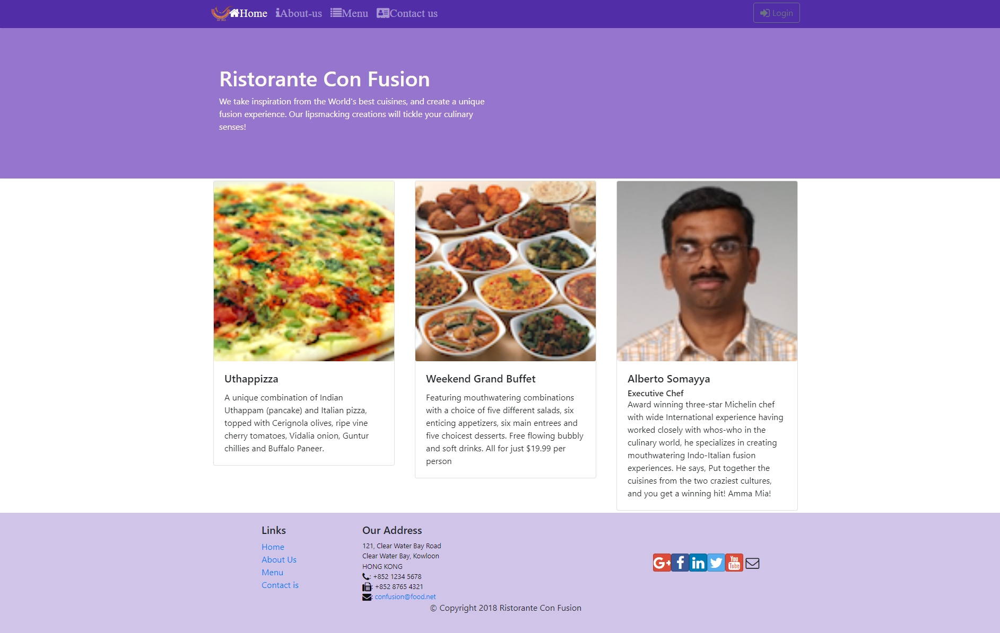

# Ristorante Con Fusion

A dynamic React-based restaurant website featuring menu exploration, dish details, and customer engagement. Built as part of the Front-End Web Development with React course.



## Features

- **Interactive Home Page**
  - Featured dish showcase
  - Special promotions section
  - Leader highlights
  - Smooth transition animations

- **Dynamic Menu**
  - Browse complete dish collection
  - Detailed dish information view
  - Customer comments and ratings
  - Comment submission system

- **About Us**
  - Restaurant history
  - Corporate leadership profiles
  - Facts and statistics
  - Mission statement

- **Contact**
  - Interactive feedback form
  - Location information
  - Contact details

## Technology Stack

- React 16.13.1
- Redux for state management
- Bootstrap 4.0.0 & Reactstrap 5.0.0
- React Router for navigation
- React Animation Components
- JSON Server for backend simulation

## Getting Started

1. Clone the repository:
```bash
git clone https://github.com/yourusername/restaurante-confusion.git
cd restaurante-confusion
```

2. Install dependencies:
```bash
npm install
```

3. Configure the API URL:

- Navigate to baseUrl.js

- For local development, set:

```javascript
export const baseUrl = "http://localhost:3001/";
```
- For production, set your deployed JSON server URL

4. Start JSON Server (for local development):
```bash
cd json-server
json-server --watch db.json -p 3001
```

5. Start the development server:
```bash
npm start
```

The application will be available at http://localhost:3000


## Live Demo

Visit the live site: [Ristorante Con Fusion](https://ristorante-confusion.vercel.app)

**Note:** Some features (like comment submission) are disabled in the live demo due to database restrictions.

## Development Learnings

- Git version control
- React component architecture 
- State management with Redux
- REST API integration
- Responsive design with Bootstrap
- Animation implementation
- Client-server communication

## Contributing

Pull requests are welcome. For major changes, please open an issue first to discuss proposed changes.

## License

This project is licensed under the MIT License:

```text
MIT License

Copyright (c) 2024 Ricardo Morim

Permission is hereby granted, free of charge, to any person obtaining a copy
of this software and associated documentation files (the "Software"), to deal
in the Software without restriction, including without limitation the rights
to use, copy, modify, merge, publish, distribute, sublicense, and/or sell
copies of the Software, and to permit persons to whom the Software is
furnished to do so, subject to the following conditions:

The above copyright notice and this permission notice shall be included in all
copies or substantial portions of the Software.

THE SOFTWARE IS PROVIDED "AS IS", WITHOUT WARRANTY OF ANY KIND, EXPRESS OR
IMPLIED, INCLUDING BUT NOT LIMITED TO THE WARRANTIES OF MERCHANTABILITY,
FITNESS FOR A PARTICULAR PURPOSE AND NONINFRINGEMENT. IN NO EVENT SHALL THE
AUTHORS OR COPYRIGHT HOLDERS BE LIABLE FOR ANY CLAIM, DAMAGES OR OTHER
LIABILITY, WHETHER IN AN ACTION OF CONTRACT, TORT OR OTHERWISE, ARISING FROM,
OUT OF OR IN CONNECTION WITH THE SOFTWARE OR THE USE OR OTHER DEALINGS IN THE
SOFTWARE.
```